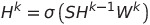
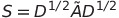
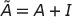
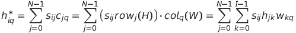
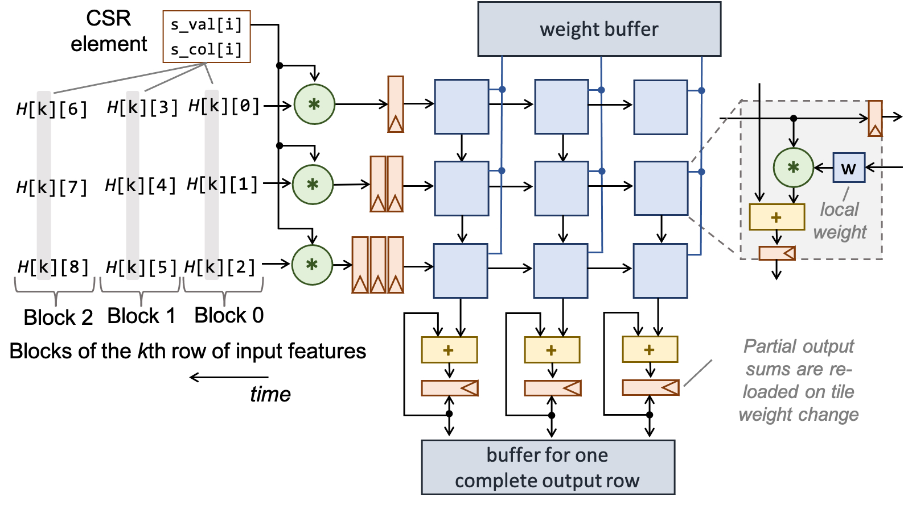

# FusedGCN: A Systolic Three-Matrix Multiplication Architecture for Graph Convolutional Networks

In this work, we focus on accelerating Graph Convolutional Networks' (GCNs) inference as some of the first and most effective processing models for Graph Neural Networks (GNNs). GNNs are able to learn graph-related representations, where nodes represent objects and edges represent the relationships between them. Thus, GNNs have been widely adopted in applications that use graph-structured data, such as social networks and recommendation systems.

Inference of a GCN layer could be represented, as shown by T. Kipf and M. Welling in [Semi-Supervised Classification with Graph Convolutional Networks (ICLR 2017)](https://arxiv.org/abs/1609.02907), as the product of the normalized adjacency matrix S, the input feature matrix H and the weight matrix W.

 

Where sigma is an activation function, H<sup>k</sup> is the output feature matrix of the k-th layer, W<sup>k</sup> is the weight matrix of the k-th layer and S is the normalized adjacency matrix computed as follows. 

 

where 

In FusedGCN, we propose the computation of this three-matrix product in a fused manner. To do so, let us firstly denote the HW product as C. Then each element c<sub>jq</sub> of C is the dot product of the j-th row of H and the q-th column of W. The final output can be computed as H<sup>*</sup> = SC. For every element of H<sup>\*</sup>, we have

 

Assuming a dense matrix S, the fused three-matrix multiplication can be expressed with the unified loop structure shown below.

```c++
for (int i = 0; i < N; i++) //temporal
  for (int p = 0; p < I; p++) //spatial parallel
    for (int q = 0; q < O; q++) //spatial parallel
      for (int j = 0; j < N; j++) //temporal
        h_star[i][q] += (s[i][j] * h[j][p]) * w[p][q];
```

Adjacency matrices of real-world graphs are extremely sparse. A simple example of a normalized adjacency matrix in CSR format is shown in the following figure.


To transform the fused three-matrix multiplication to operate directly on CSR representation, we need to replace the instances of s[i]\[j] in the previous code block with the corresponding CSR representation of the non-zero elements of S.
```c++
for (int i = 0; i < N; i++) //temporal
  for (int p = 0; p < I; p++) //spatial parallel
    for (int q = 0; q < O; q++) //spatial parallel
      for (int j = S_pos[i]; j < S_pos[i+1]; j++) //temporal
        h_star[i][q] += (S_val[j] * h[S_col[j]][p]) * w[p][q];
```

The outer loop passes through all the rows of matrix S (each node of the graph is visited once). The non-zero elements of a selected row of S (row 2 in the following figure) with value S_val[j] are multiplied with all the elements of the row of H that corresponds to the column S_col[j]. The product derived for each non-zero element is multiplied with all columns of W to produce a complete row of the output. Since S is sparse, only selected rows of H are fetched: the ones that correspond to the columns of the non-zero elements of S.


In FusedGCN, we adopt a weight-stationary systolic array philosophy, whereby the weight matrix of a convolution layer is pre-loaded and reused for computing the convolution of all nodes of the graph. The computation for the i-th output row is split in N steps executed serially in time, but in a pipelined fashion. The same steps are performed in parallel for all elements that belong to the same output row, using the following systolic array.


In each cycle, we take one non-zero element of S with value S_val[j] and multiply it in parallel with all elements of the corresponding row of matrix H (selected by S_col[j]). The output of the multipliers is then multiplied (dot product) in parallel with all columns of the weight matrix by the systolic array. Each processing element of the systolic array multiplies the broadcast value with the locally-saved weight and adds to this product the output of the above processing element of the same column. Once summation is completed, it forwards the result to the next processing element of the same column in the next cycle.

The partial result computed at the output of each column of the systolic array for one non-zero element of S should be added to the results produced by the remaining non-zero elements of the same row of S. This addition is done by the accumulators shown at the bottom of each column of the systolic array. The computation for the i-th output row is completed when all elements of the i-th row of S have entered the systolic array. When starting to compute a new output row, we first need to re-initialize the value of the output accumulators to zero. The already loaded weights do not need to change and they can be reused for all rows of S.

In real-world applications it is infeasible to fetch a whole row of H from memory in a single cycle. Thus, a row of H would be fetched in multiple segments/partitions, over consecutive clock cycles. The same limitation exists on the output side, i.e., when trying to write in memory a computed row of the output H<sup>*</sup>. In most practical cases, the computed row would be stored in multiple segments. The computation engine should match this read/write throughput limits to avoid underutilization. Therefore, a systolic array of size K × M would be enough to sustain the input/output bandwidth, assuming that we can read K words and write M words in each cycle.

The figure below depicts a 3×3 systolic array used to compute in tiles the fused product of a GCN layer with I = 9 input features and O = 6 output features per node, respectively. Even if the computation evolves in more steps to facilitate the limited input-output bandwidth, the basic rule of the operation of FusedGCN does not change: one output row is first fully computed before moving to the next one.


Tiled computation shown previously can be expressed in a loop structure as follows.
```c++
for (int i = 0; i < N; i++) //temporal
  for (int k = 0; k < I/M; k++) //temporal
    for (int r = 0; r < O/M; r++) //temporal
      for (int p = 0; p < K; p++) //spatial parallel
        for (int q = 0; q < M; q++) //spatial parallel
          for (int j = S_pos[i]; j < S_pos[i+1]; j++) //temporal
            h_star[i][q+(r*M)] += (S_val[j]* h[S_col[j]][p+(k*M)])* w[p+(k*M)][q+(r*M)];
```


# Repository hierarchy

The folders of this repository are organized as follows:

* `images`: figures shown in readme
* `systolic_example`: example of a small problem, where whole matrices fit in the systolic
* `tiled_example`: example of a real-world application using systolic array smaller than the matrix dimensions


# Implementation

FusedGCN implemented in C++ using [Fast-Float4HLS](https://github.com/ic-lab-duth/Fast-Float4HLS) floating-point representation, that depends on ac_fixed library from [HLSLibs](https://github.com/hlslibs/ac_types).

Also the post-synthesis RTL co-simulation of the given examples require the sc_verify flow of Catapult HLS. The necessary header (mc_scverify) is publicly available in [ac_simutils](https://github.com/hlslibs/ac_simutils/tree/master/include).

Downloading the needed header-only libraries can be done by running the provided script `set_libs.sh`.

All the examples implement a 2-layer GCN using the ReLU activation function for the hidden layer and a hard decision (maximum) function for the output layer.


# Future Work

* Hardware implementation of the softmax activation function


# Reference

FusedGCN will be presented in IEEE International Conference on Application-specific Systems, Architectures and Processors, Jul. 2022. To cite this work please use:

```
@inproceedings{FusedGCN,
author={C. {Peltekis} and D. {Filippas} and C. {Nicopoulos} and G. {Dimitrakopoulos}},
booktitle={2022 IEEE International Conference on Application-specific Systems, Architectures and Processors (ASAP)},
title={Fused{GCN}: {A} {S}ystolic {T}hree-{M}atrix {M}ultiplication {A}rchitecture for {G}raph {C}onvolutional {N}etworks},
year={2022},
volume={},
number={},
pages={},
}
```


# License

FusedGCN is licensed under the MIT License.